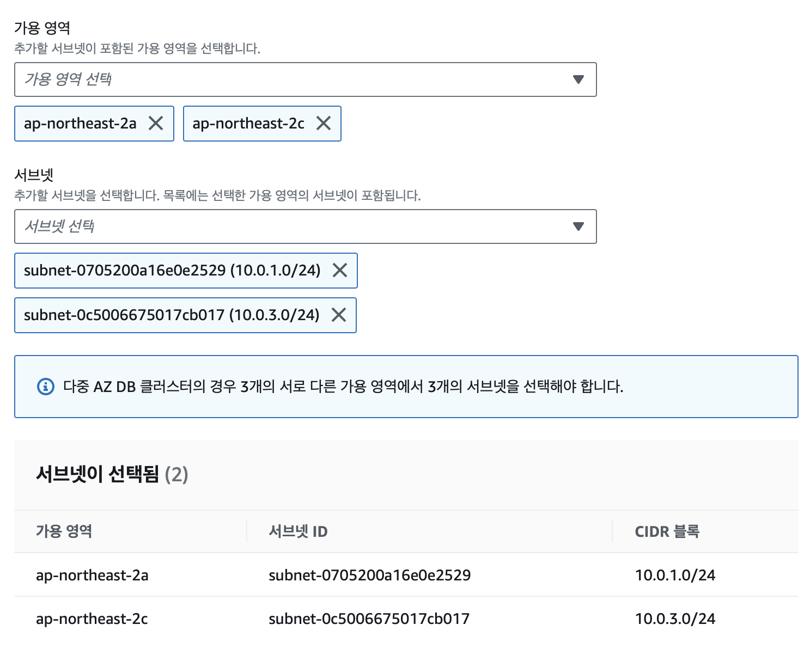
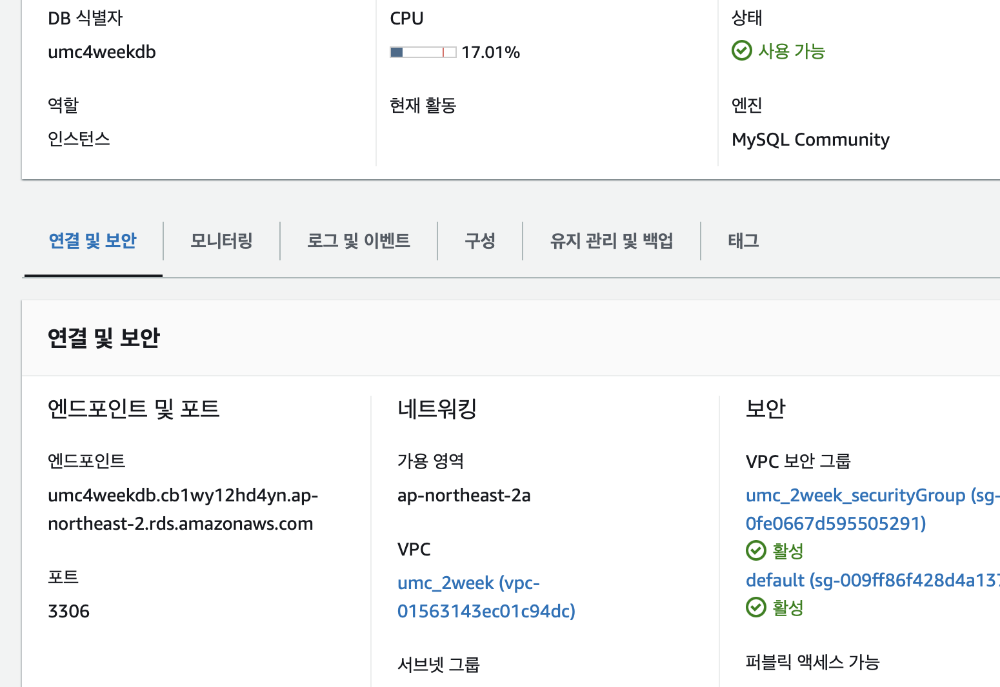

# UMC_SpringBoot_Study

✏️ DB는 어디에 두는 것이 좋을까요?
로컬 컴퓨터에 DB를 두면 포트포워딩이 필요하고 로컬의 전원이 꺼졌는지의 유무에 따라 DB접속 가능 여부가 달라지기 때문에,
DB는 로컬이 아니라 외부에 두는 것이 좋습니다.

외부에 DB를 놓는 방법에는,
1. EC2에 DB 설치하기
2. RDS 사용하기
크게 두 가지 방법이 있으나, 4week에서는 RDS를 사용해보도록 하겠습니다‼️
  

# RDS 설치하기
2주차 때 만들었던 VPC를 사용하도록 하겠습니다

## ✅ 서브넷 하나 더 생성하기
RDS는 서브넷을 2개 요구한다고 합니다.
2week때 만들었던 subnet에 이어 4week subnet을 하나 더 만들어줍니다.  

 
## ✅ 라우팅 테이블에 서브넷 연결하기
새로 만든 서브넷을 퍼블릭으로 설정하기 위해 
2week때 만들어둔 라우팅 테이블에 연결을 해줍니다  

 
## ✅ DB subnet 생성
**RDS - 서브넷 그룹 - DB 서브넷 그룹 생성**
2주차 때 만들었던 VPC를 선택한 후
2week 서브넷과 4week 서브넷을 서로 다른 가용영역으로 추가해줍니다   

 
## ✅ DB 생성
**RDS - DB - DB 생성**

생성 전, **VPC - DNS 설정** 에 가서
⭐️**DNS 호스트 이름 활성화**⭐️를 체크해줍니다.

- VPC 선택 (미리 만들어둔 2week VPC 선택)
- 앞서 생성한 DB 서브넷그룹 선택
- Public Access Yes
- VPC 생성 시 만들었던 보안그룹 선택  
    ⚠️ 인바운드 규칙 때문에 ❗️**3306포트 anywhere**❗️ 꼭 포함되어야 함

위의 과정대로 진행하면 아래 사진처럼 DB 생성이 완료됩니다  

   
# RDS 원격 접속
**DataGrip**을 이용해 DB를 외부에서 접속해보겠습니다

1. DB의 엔드포인트를 복사
2. DataGrip 연결 새로 만들기
3. **Host에 엔드포인트 넣기**
4. User, Password에 RDS만들 때 기입했던 정보 작성
5. TEST CONNECTION 

