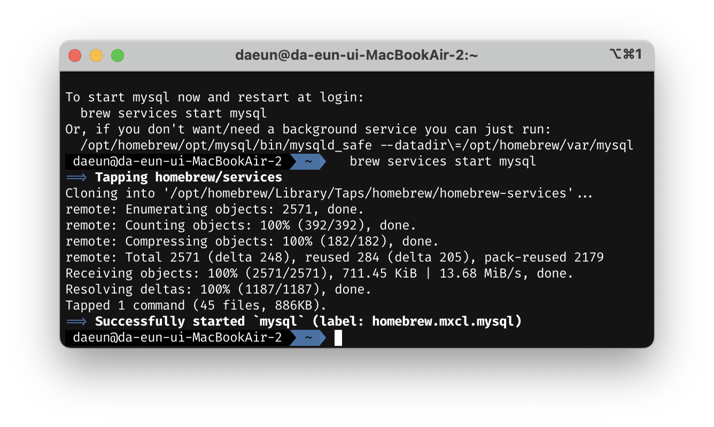
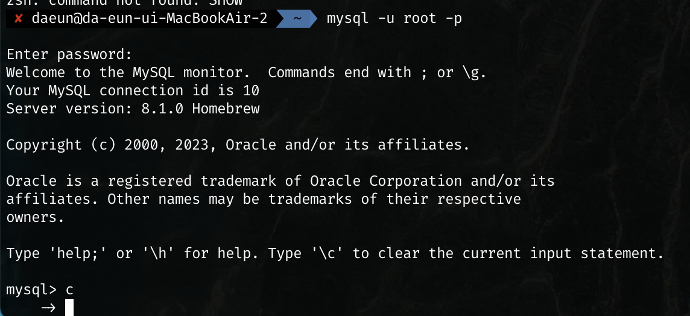

# UMC_SpringBoot_Study


<br>

# WorkBook

### ✅ 프로젝트 생성
- `UMC_SpringBoot_Mission` 이라는 SpringBoot project 생성
- 디렉토리 컨벤션  <br>

<br>

### ✅ DB 준비
RDS DB와 로컬 mysql 중 편한 DB를 사용하면 되는데, 저는 mysql을 사용해서 실습을 진행하도록 하겠습니다 <br>
- mysql 설치 <br>
    `brew install mysql` 을 통해 mysql을 설치해줍니다 <br>
- mysql 시작 <br>
    `brew services start mysql` 명령어를 통해 mysql 서비스를 시작할 수 있습니다 <br>
     <br>
- mysql security 설정 <br>
    초기 설정의 경우, 사용자 비밀번호가 설정되어있지 않아 mysql 서비스는 root 비밀번호 없이 실행됩니다 <br>
    `mysql_secure_installation` 명령어를 통해 보안을 위한 root 비밀번호를 설정할 수 있습니다 <br><br>
         <br><br> 
- mysql 로그인 <br>
    비밀번호 설정을 마쳤다면, `mysql -u root -p` 명령어를 사용해 mysql에 root 계정으로 로그인할 수 있습니다 <br><br>
     <br><br>
- mysql db 준비 <br>
    mysql 설치를 끝냈다면, **`study`라는 이름으로 db를 만들어줍니다** <br> <br>
        
    <br><br>
    build.gradle에 `runtimeOnly 'com.mysql:mysql-connector-j'` 를 넣어 의존성 관계를 추가해주고, <br>
    db 연결을 위해 프로젝트에 `application.yml`을 추가해줍니다 <br><br>
    ```
    spring:
  datasource: 
    url: jdbc:mysql://localhost:3306/study
    username: 님들의 유저 이름
    password: 님들의 비밀번호
    driver-class-name: com.mysql.cj.jdbc.Driver
  sql:
    init:
      mode: never
  jpa:
    properties:
      hibernate:
        dialect: org.hibernate.dialect.MySQL8Dialect
        show_sql: true
        format_sql: true
        use_sql_comments: true
        hbm2ddl:
          auto: update
        default_batch_fetch_size: 1000
    ```
     
    
    


    
    


    

